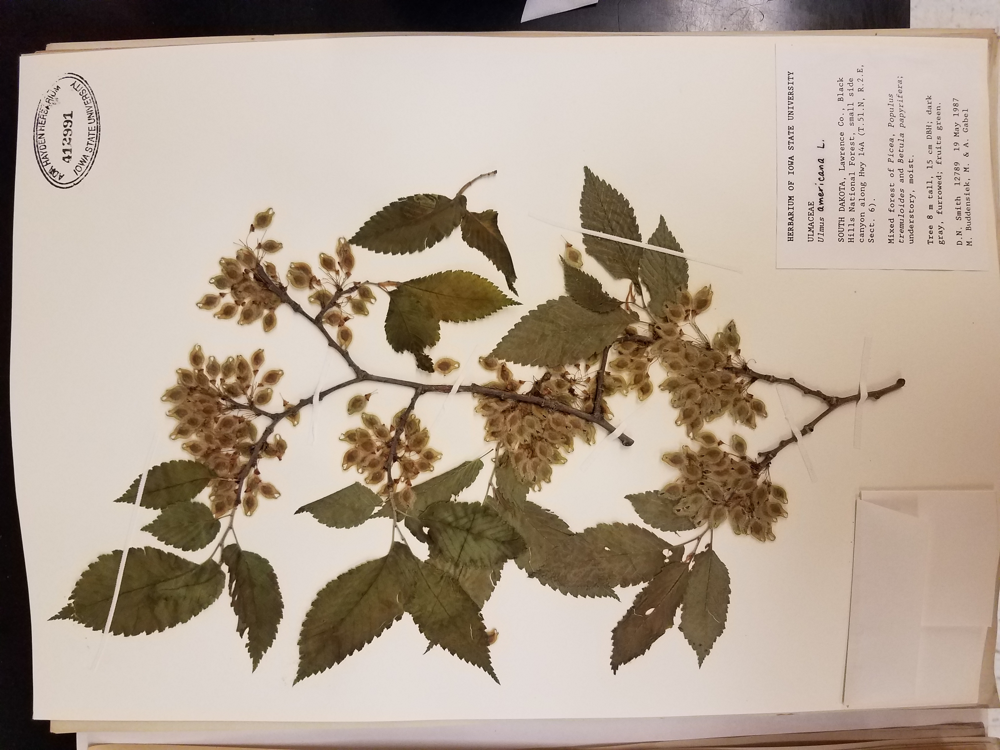

# Collections

::: {style="float:right;position: relative; top: -15px; padding: 10px"}
{width="150"}
:::

The Flora of Missouri project cataloged the phytoliths of 117 species native to Missouri, using material from specimens in Iowa State University's [Ada Hayden Herbarium](https://www.herbarium.iastate.edu/)

::: {style="float:left;position: relative; top: 0px; padding: 10px"}
{height="400"}
:::

The physical reference collection is permanently housed in the Ada Hayden Herbarium. The digital reference collection, consisting of more than 500 images, is available via the [PhytCore database](https://www.phytcore.org/phytolith/index.php?rdm=eGRbjhsuJo&action=searchphyt) by selecting "Ada Hayden Herbarium" under the Research Group dropdown menu.

{height="220"}{height="220"}
