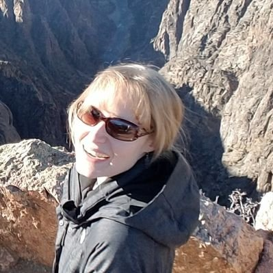
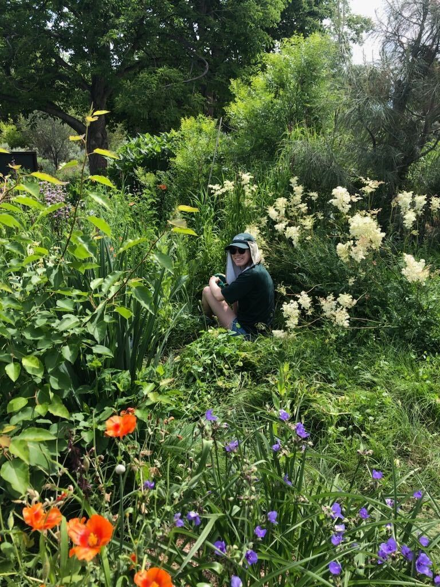
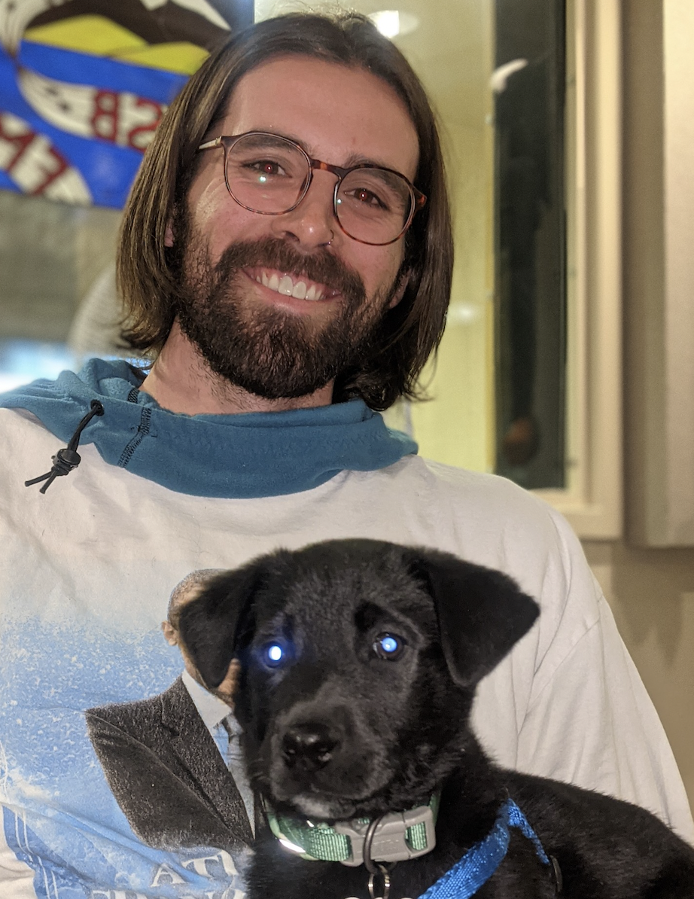

```{r setup, include=FALSE}
knitr::opts_chunk$set(echo = TRUE)
```

```{r load_packages, message=FALSE, warning=FALSE, include=FALSE}
library(fontawesome)
```

------------------------------------------------------------------------

### Hannah M. Carroll (she/her)

##### Principal Investigator

{width="300"}

[{width="30"}](mailto:hcarroll@western.edu) [{width="30"}](https://github.com/hannahcarroll) [{width="30"}](https://orcid.org/0000-0003-3343-3358) [{width="30"}](https://www.researchgate.net/profile/Hannah-Carroll-7) [{width="30"}](https://scholar.google.com/citations?user=rzsu0zoAAAAJ&hl=en&authuser=4) [{width="30"}](https://twitter.com/hmcarro) [{width="30"}](CV_web.html)

------------------------------------------------------------------------

### Laurel Trout (she/her) [{width="30"}](mailto:laurel.trout@western.edu)

##### Master's of Science in Ecology student (3+2)

###### Denver Botanic Gardens 2023 Summer Horticulture Intern

<div style= "float:left;position: relative; top: 0px; padding: 10px">
{width="300"} 
</div>

Laurel's thesis research is reconstructing precipitation shifts in the western United States through the Last Glacial Maximum, as far back as 22,000 years ago. She is utilizing fossil pollen records from the Neotoma Paleoecology Database to undertake this large-scale spatiotemporal reconstruction. From these records, she is extracting fossil pollen from the genera *Artemisia*, which is resilient to drought, and *Ambrosia*, which is moderately sensitive to drought. These genera differ in their response to disturbance, making them model genera for precipitation reconstructions. She is also producing a correction factor for the disturbance signal produced by European colonization in the Western United States. She aims to improve the overall accuracy and refine error estimates of spatiotemporal precipitation reconstructions using the log ratio of *Ambrosia* to *Artemisia* pollen. Results could serve as a proxy for future climate change projections, providing key information to inform management decisions.

Laurel's hobbies include trail running and hiking, and she has recently started rock climbing. She has lived in Gunnison, Colorado for 3 years and is originally from Durango, Colorado.

------------------------------------------------------------------------

### Phoebe Roberts

##### EMPLOYS student (MSE & MEM)

###### High Country Conservation Advocates Fellow

------------------------------------------------------------------------

### Naomi Koster

##### EMPLOYS student (MSE & MEM)

------------------------------------------------------------------------

### Destan Gerhard (he/him/his)&nbsp;[{width="30"}](mailto:destan.gerhard@western.edu)

##### Master's of Environmental Management student

<div style= "float:left;position: relative; top: 0px; padding: 10px">
{width="300"}  
</div>

I’m currently working on my Master’s project, which focuses on the nexus of wetland restoration, wildlife habitat, and beef production. I’m conducting baseline water quality monitoring, soil moisture monitoring, plant identification, and overall vegetation density monitoring on a portion of a 200+ acre ranch 15 miles east of Gunnison, CO. In Fall 2023, I will be managing the construction of 10 low-tech wetland restoration tools known as Beaver Dam Analogues. I will gather qualitative data from the ranching operation that has a lease to use the study-area pasture for cattle grazing.

Outside of my schoolwork and research, I’m a dog, cat, and bunny parent with my amazing partner Greyce. In my free time I like doing things such as rock climbing, backpacking, snowboarding, permaculture farming, sewing, sketching, photography, reading, going to concerts, and just enjoying all that Colorado and the Western US has to offer.  

------------------------------------------------------------------------

### Katrina Stanek

##### Master's of Environmental Management student (3+2)

------------------------------------------------------------------------

### Caleb Park

##### Master's of Environmental Management student
