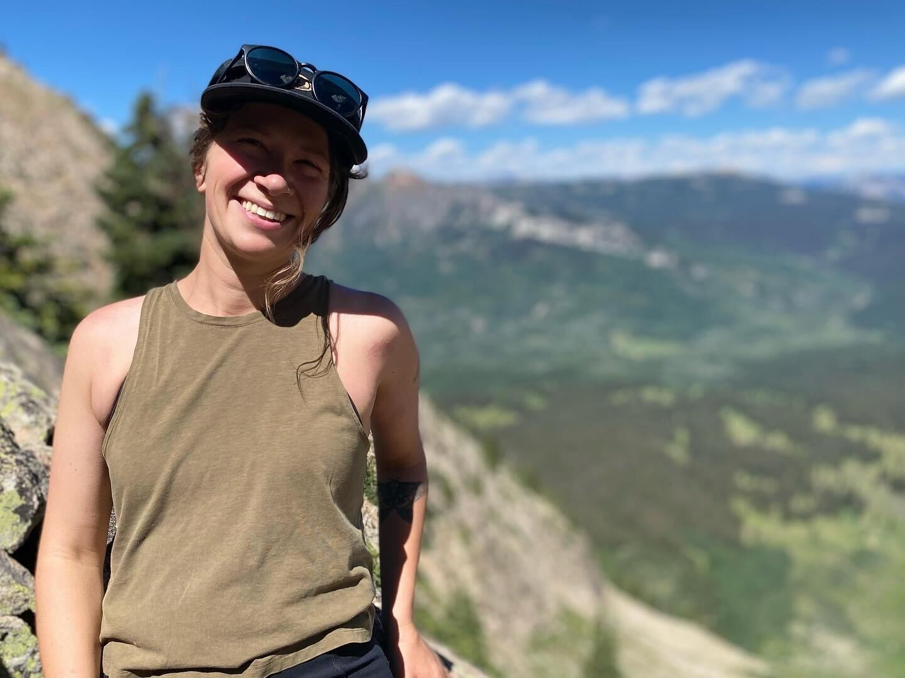
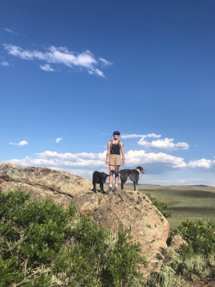
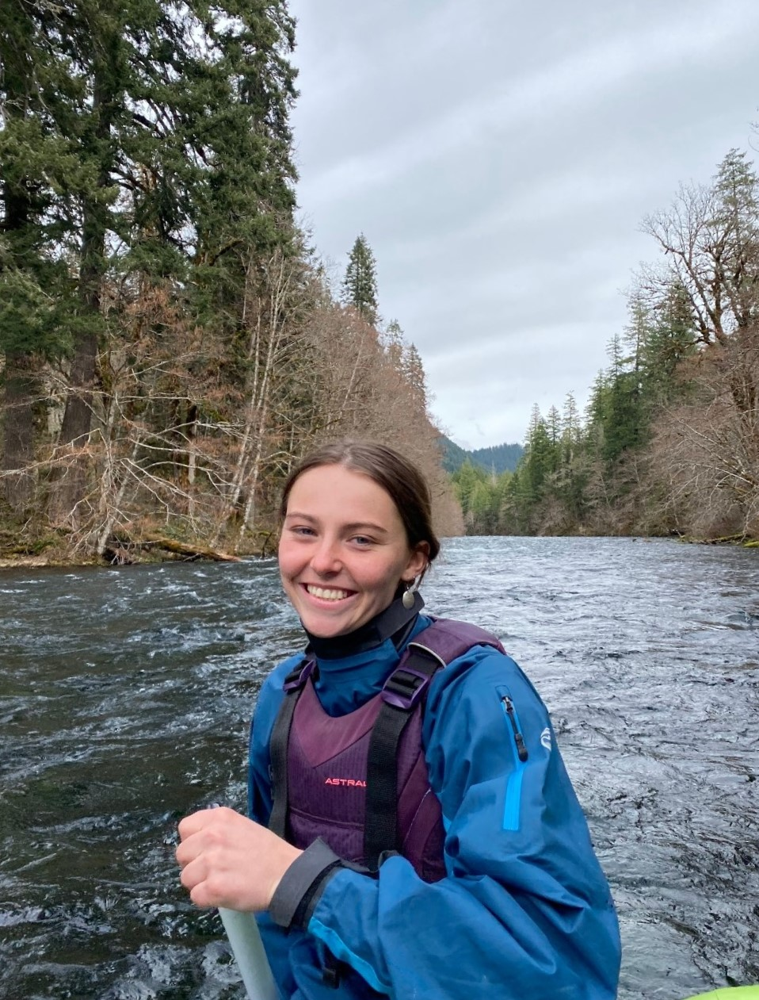

```{r setup, include=FALSE}
knitr::opts_chunk$set(echo = TRUE)
```

```{r load_packages, message=FALSE, warning=FALSE, include=FALSE}
library(fontawesome)
```

------------------------------------------------------------------------

### Hannah M. Carroll (she/her)

##### Principal Investigator

{width="300"}

[{width="30"}](mailto:hcarroll@western.edu) [{width="30"}](https://github.com/hannahcarroll) [{width="30"}](https://orcid.org/0000-0003-3343-3358) [{width="30"}](https://www.researchgate.net/profile/Hannah-Carroll-7) [{width="30"}](https://scholar.google.com/citations?user=rzsu0zoAAAAJ&hl=en&authuser=4) [{width="30"}](https://twitter.com/hmcarro) [{width="30"}](CV_web.html)

------------------------------------------------------------------------

## Graduate Students

------------------------------------------------------------------------

### Laurel Trout (she/her) [{width="30"}](mailto:laurel.trout@western.edu)

##### Master's of Science in Ecology student (3+2)

###### Denver Botanic Gardens 2023 Summer Horticulture Intern

<div style= "float:left;position: relative; top: 0px; padding: 10px">
{width="300"} 
</div>

Laurel's thesis research is reconstructing precipitation shifts in the western United States through the Last Glacial Maximum, as far back as 22,000 years ago. She is utilizing fossil pollen records from the Neotoma Paleoecology Database to undertake this large-scale spatiotemporal reconstruction. From these records, she is extracting fossil pollen from the genera *Artemisia*, which is resilient to drought, and *Ambrosia*, which is moderately sensitive to drought. These genera differ in their response to disturbance, making them model genera for precipitation reconstructions. She is also producing a correction factor for the disturbance signal produced by European colonization in the Western United States. She aims to improve the overall accuracy and refine error estimates of spatiotemporal precipitation reconstructions using the log ratio of *Ambrosia* to *Artemisia* pollen. Results could serve as a proxy for future climate change projections, providing key information to inform management decisions.

Laurel's hobbies include trail running and hiking, and she has recently started rock climbing. She has lived in Gunnison, Colorado for 3 years and is originally from Durango, Colorado.

------------------------------------------------------------------------

### Phoebe Roberts (she/her) [{width="30"}](mailto:phoebe.roberts@western.edu)

##### EMPLOYS student (MSE & MEM)

###### High Country Conservation Advocates Fellow

<div style= "float:left;position: relative; top: 0px; padding: 10px">
{width="300"}  

</div>

Phoebe is a dual degree MSE and MEM student through the EMPLOYS program. Her MSE thesis will apply paleoecological techniques to develop a pre-European settlement vegetation baseline in critical Gunnison Sage Grouse habitat in order to develop a benchmark to help guide future restoration efforts and provide a deeper understanding of Gunnison Sage Grouse habitat requirements. She will use silica plant fossils called phytoliths to identify key historic botanical genera correlated to pre-European Gunnison Sage Grouse habitat. The goal is to determine how the composition of botanical genera have been altered following the decline in population of Gunnison Sage Grouse, and to identify key genera correlated to Sage Grouse habitat. She hopes her thesis will provide adequate environmental data to help aid environmental managers with restoration or conservation efforts pertaining to Gunnison Sage Grouse and all other wildlife associated with the sage steppe ecosystem.  

For her MEM project, Phoebe will apply her findings to a Gunnison Sage Grouse restoration project by selecting key species for seed mix composition and species most resilient to climate change. She hopes that her findings will help ensure that the habitat is restored within realistic expectations, and that resources are applied appropriately to conservation efforts.
Originally from Issaquah, Washington, Phoebe has lived in the Gunnison valley on and off since 2016. She has worked a variety of ecological monitoring and wildlife jobs after graduating from the University of Oregon with a BS in Environmental Science, sparking her interest in ecology. In her spare time, she enjoys mountain biking and snowboarding.

------------------------------------------------------------------------

### Destan Gerhard (he/him/his)[{width="30"}](mailto:destan.gerhard@western.edu)

##### Master's of Environmental Management student

<div style= "float:left;position: relative; top: 0px; padding: 10px">
{width="300"}  
</div>

I’m currently working on my Master’s project, which focuses on the nexus of wetland restoration, wildlife habitat, and beef production. I’m conducting baseline water quality monitoring, soil moisture monitoring, plant identification, and overall vegetation density monitoring on a portion of a 200+ acre ranch 15 miles east of Gunnison, CO. In Fall 2023, I will be managing the construction of 10 low-tech wetland restoration tools known as Beaver Dam Analogues. I will gather qualitative data from the ranching operation that has a lease to use the study-area pasture for cattle grazing.

Outside of my schoolwork and research, I’m a dog, cat, and bunny parent with my amazing partner Greyce. In my free time I like doing things such as rock climbing, backpacking, snowboarding, permaculture farming, sewing, sketching, photography, reading, going to concerts, and just enjoying all that Colorado and the Western US has to offer.  

------------------------------------------------------------------------

### Katrina Stanek

##### Master's of Environmental Management student (3+2)

------------------------------------------------------------------------

### Caleb Park

##### Master's of Environmental Management student

------------------------------------------------------------------------

### Jenna Tansill (she/her) [{width="30"}](mailto:jennifer.tansill@western.edu)  

##### Master's of Ecology student (incoming Fall 2024)

<div style= "float:left;position: relative; top: 0px; padding: 10px">
{width="300"}  
</div>

Jenna’s thesis research includes collaboration with the United States Forest Service (USFS) and involved permittees to perform relatively standard vegetation monitoring across the Gunnison County on leased allotments to evaluate the impact of grazing on critical Gunnison Sage Grouse habitat in each browsed pasture. Alongside the vegetation monitoring structure, she plans to implement a Geographic Information System (GIS) aspect to comprehend the broader spatial extent of the collected data throughout the landscape and in situ methods to understand the interaction between anthropogenic disturbance and phenology on vegetation structure and obligate species habitat to determine alternative approaches to managing the sagebrush steppe ecosystem.  

Jenna is a Colorado native, originally from Monument, Colorado. She’s been in the Gunnison Valley for the past couple of years living out of a renovated off grid cargo trailer with her chocolate companion, Rooster. She’s an advocate for the Honorable Harvest and extending reciprocity to the land. During her spare time, she enjoys backpacking, climbing, mountain biking, snowboarding, and anything that brings her closer to the natural world.  

------------------------------------------------------------------------

## Undergraduate Researchers

------------------------------------------------------------------------

### Kamis Monohan  

##### Senior in Biology, Chemistry minor  

<div style= "float:left;position: relative; top: 0px; padding: 10px">
{width="300"}  
Project: Assessing energy flow and trophic interactions in a tailwater fishery using stable isotopes of carbon and nitrogen  

### Laura Brignoli  

##### Senior in Biology, Chemistry minor  

Project: Assessing long-term hydroclimatic variability in the high southern Rockies using light stable isotopes of oxygen in alpine lake sediments  

</div>