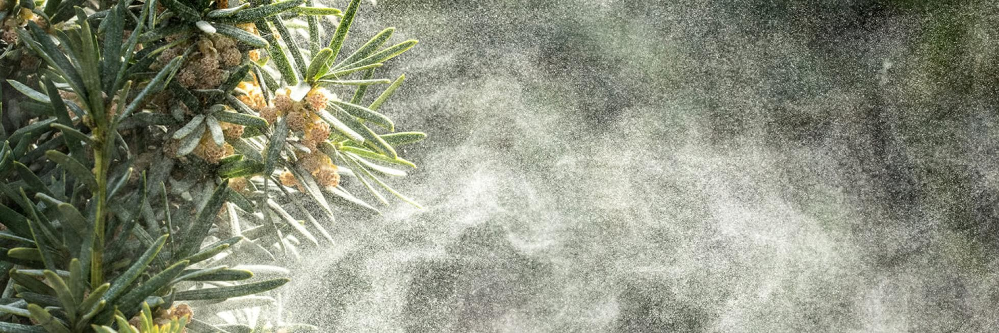

```{r setup, include=FALSE}
knitr::opts_chunk$set(echo = TRUE)
```

# The Western Paleoecology Lab studies three main areas

-   Local to regional expressions of climate change

-   Ecological impacts of rapid climate change at multiple spatiotemporal scales

-   Improved computational tools for studying past environments

{width="100%"}

My work is focused at the intersection of community ecology, biogeography, and climate science. In particular, I am interested in working to advance our understanding of the complex relationships underlying vegetation distributions and their relationships to climate change over geologic time, from regional to continental scales, and from modern communities to those that were living in the distant past. I rely on a variety of field-based, computational, and experimental approaches in my research.

Projects by researchers in the lab range from mathematical modeling of the relationships between fossil pollen assemblages and climate; to the development of restoration baselines grounded in the vegetation of the recent past; to the reconstruction of postglacial climate from sediments deposited in high-altitude Bolivan lakes; to low-tech solutions for successful restorations; and experiments on modern vegetation to determine their suitability for restoration.

